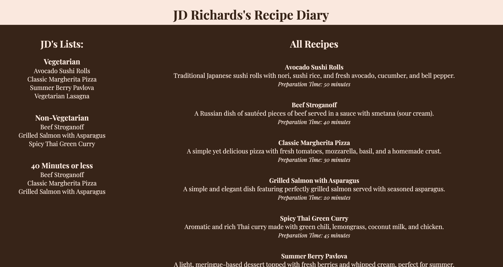
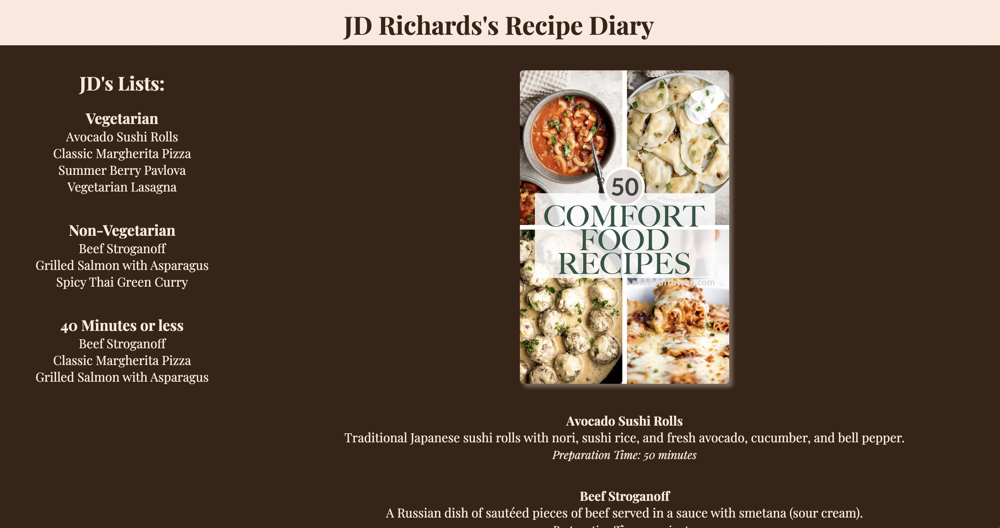

# ReactJS Recipe Diary

#### This is an exercise in passing props to components, making lists, and making calculations.

**INSTRUCTIONS:**
Refer to the image below

### Header Component:

- Pass a name object as a prop from the App component to the Header Component.
- Use the name prop for the first name in your Header and append hard-coded text to - indicate it's your Recipe Diary (e.g., "JD’s Recipe Diary").

### Aside Component:

- Pass both the name object and the recipes array as props to the Aside component.
- Using your name props, create an `<h2>` tag displaying the first name with an apostrophe 's' and the word Lists (e.g., "JD’s Lists").
- Add two `<h3>` tags: one labeled ‘Vegetarian’ and the other ‘Non-Vegetarian’.
- Under each `<h3>` tag, create an unordered list.
- In each list, using `<li>s` display the relevant recipes based on the isVegetarian key from the data.
- Use the id as the key when you map through the list

### Main Component:

- Add an `<h2>` tag titled ‘All Descriptions’.
- List all of the recipes:
  - Use an `<h4>` tag for the title.
  - Use a `
` tag for the summart.
  - Use a `` tag for displaying the minutes. (see image above)

## Bonus Challenges:

1. Create a ListItem component for the `<li>` elements and utilize it in Main.js when mapping through the recipes.
1. Sort the recipes in the App.jsx component by title and send information as props to the Main.jsx component alphabetically by title.
1. Implement a helper function to sort the recipes by title in the Main component.
1. In the Aside component, create another list showcasing the fastest recipes (those that take 40 minutes or less to cook).
1. Replace the "All Recipes" header with an image of your choice. You can add this image to your directory or use an external link (with 'http').
1. Consider additional features or information you could incorporate into this app.

